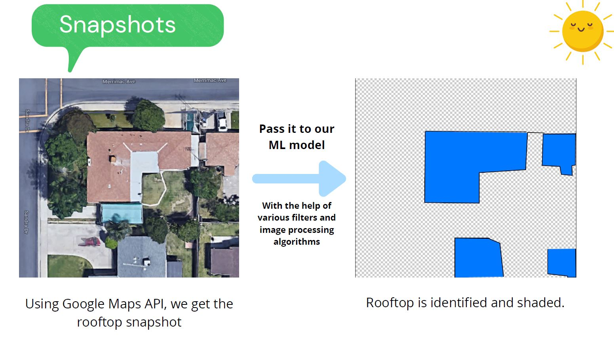

# Solar.ai - The Solar Map Project

World׳s energy demand is growing fast because of population explosion and technological advancements.
It is therefore important to choose reliable, cost effective and everlasting renewable energy source for energy needs.
**Solar Energy** is the future. It is easily deployable without disturbing the infrastructure and without causing any harm to the environment.
This is why we are creating Solar.ai which using **Geospatial analysis**, helps local communities to move in the direction of a solar future. With the help of satellite imagery, our app gives the estimation of the

- Rooftop area
- The solar intensity value
- The number of solar panels required to cover the rooftop
- Estimated costs of installation
- The power generated in KWH yearly

    
  

**How do we do it?**
Firstly, we get the Satellite Imagery with the help of Google Maps or OpenStreetMaps and segment out the rooftop using various machine learning algorithms in conjuction with openCV image processing.Then with the zoom level, we convert the pixels to area, that is we calculate out the area of the rooftop. So lets say if the area of the rooftop is 480 m^2, then we can find the number of solar panels required to cover that particular rooftop and can also find its associated costs.

    
  

Now the efficiency of the solar cell depends on other factors also, like the solar irradiance/intensity value of a certain place. Lets say if I live in India, then I receive enormous amount of sunlight throughout the year but lets say if someone lives near the poles, then he/she may not receive the same amount of sunlight, for him/her the efficiency will be low. So to solve this problem, we have made a Solar Radiation intensity Classifier, that using Solar irradiance dataset(mapped to longitude and latitude of the roof) classifies the rooftops in shades of red.

- Highly saturated red implies high potential and low shades as well as darker shades imply lower potential.

    
  

### Results

    
  

    
  

  

  

Now you know your rooftop potential, now we also show you the nearby stores from which you can buy those **Solar Panels**
Moreover we show you various options depending on the power generation per Dollar you spent.

  

  

